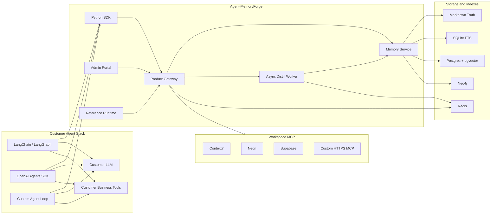
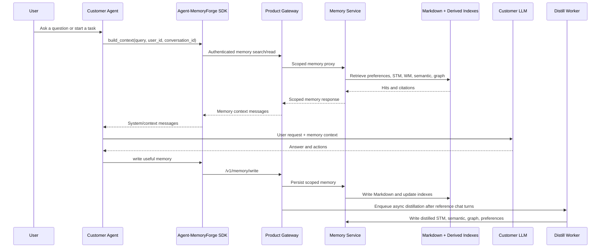
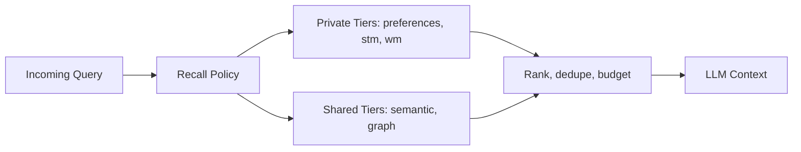

# Agent-MemoryForge

**Agent-MemoryForge is a production-oriented memory layer for AI agents.**

It gives customer-owned agents durable, searchable, scoped, auditable memory
without forcing teams to replace LangChain, LangGraph, OpenAI Agents SDK,
AutoGen, CrewAI, custom agent loops, or their own MCP tool stacks.

Agent-MemoryForge is not trying to be another all-in-one agent platform. It is
the memory plane that serious agent systems usually end up needing after the
first demo works:

- tenant and workspace isolation
- short-term conversation checkpoints
- active working memory for tasks
- durable user preferences
- semantic facts and business decisions
- graph-style relationships
- async memory distillation
- authenticated SDK and REST integration
- admin/operator portal
- quota and usage accounting
- workspace MCP configuration and encrypted workspace secrets
- structured logs for recall, tool intent, distillation, and usage

The Python package name is still `agent-memory` for compatibility. The product
name is **Agent-MemoryForge**.

---

## Why This Exists

Most agent prototypes treat memory as a prompt appendix, a vector store, or a
chat history table. That works for a demo, but it breaks down when the system
has real customers, multiple workspaces, operational quotas, private user state,
shared project facts, memory update rules, and debugging requirements.

Agent-MemoryForge is designed around a simple product belief:

> The customer's agent should own reasoning and tool orchestration. The memory
> product should own scoped memory storage, retrieval, indexing, distillation,
> auditability, and tenant controls.

This separation keeps your agent architecture flexible. A customer can build
with LangChain today, migrate to LangGraph later, use an internal orchestration
runtime next quarter, and still keep the same memory API.

---

## What Agent-MemoryForge Is

Agent-MemoryForge is a memory infrastructure product with five main surfaces:

| Surface | Role | Customer contract |
| --- | --- | --- |
| SDK | Customer integration layer | Build memory context and write memory from external agents |
| Product Gateway | Public API/control plane | Auth, workspace routing, memory proxy, portal APIs, reference chat, quotas |
| Memory Service | Internal data plane | File-first memory storage, search, read/write, derived index rebuilds |
| Portal | Admin/operator console | Users, quotas, workspaces, MCP secrets, memory inspection, monitoring |
| Reference Runtime | Validation agent | Demo and smoke-test runtime, not required for production customers |

The preferred enterprise mode is the **Memory Layer** mode:

1. Customer agent receives a user request.
2. Customer agent calls Agent-MemoryForge SDK or Gateway memory APIs.
3. Agent-MemoryForge returns scoped memory context.
4. Customer agent sends memory context plus the request to its own LLM stack.
5. Customer agent writes useful facts, preferences, task state, or graph
   relations back to Agent-MemoryForge.

---

## What Agent-MemoryForge Is Not

Agent-MemoryForge is intentionally not:

- a replacement for LangChain, LangGraph, OpenAI Agents SDK, AutoGen, or CrewAI
- a generic hosted MCP marketplace
- a vector database wrapper only
- a stateless chatbot
- a system that asks tenants to provide arbitrary local stdio processes in a
  hosted SaaS environment
- a product where Redis, pgvector, or Neo4j become the source of truth

Those boundaries matter. They keep the memory product predictable, auditable,
and deployable in multi-tenant environments.

---

## Core Capabilities

### Multi-Tenant Memory

Every memory operation is scoped by:

- `tenant_id`
- `workspace_id`
- actor identity for private tiers

`semantic` and `graph` memories are workspace-shared knowledge.
`preferences`, `stm`, and `wm` are actor-private unless accessed by an admin,
system, or service actor.

### File-First Source Of Truth

Markdown files are the canonical memory record. Derived stores can be rebuilt.

This makes the system inspectable:

- humans can review memory artifacts
- entries can include source metadata
- corrupted derived indexes are recoverable
- operational audits do not depend on opaque vector-only state

### Derived Search Indexes

Agent-MemoryForge can use multiple derived stores:

- SQLite FTS for local keyword/BM25 search
- Postgres/pgvector for production semantic vector search
- Neo4j for optional graph indexing
- Redis for queues, conversation windows, metrics, runtime cache, and audit

The derived stores accelerate recall. They do not replace the Markdown truth.

### Async Distillation

Chat requests do not run heavy memory extraction inline. The Gateway enqueues a
distillation job. The worker decides what should become STM, semantic facts,
graph facts, or preferences.

That keeps user-visible latency isolated from:

- LLM extraction latency
- retries and rate limits
- memory store failures
- derived index writes

### Context Selection

The SDK and runtime assemble memory context from multiple tiers:

- user preferences
- recent STM
- active WM
- semantic facts
- graph facts

An optional context planner can use a cheaper LLM to decide which memory tiers
to include for a specific query. The default deterministic path remains usable
without that planner.

### Workspace MCP Configuration

Workspace MCP configuration is tenant/workspace data. Users configure remote
HTTPS MCP servers and workspace secrets through the portal. Secrets are stored
encrypted and referenced by placeholder names such as `${CONTEXT7_API_KEY}`.

Local stdio MCP is operator-only. Hosted multi-tenant deployments should not
start arbitrary tenant-defined local processes.

### Reference Agent Runtime

The included runtime is a validation surface:

- prove memory recall
- prove memory write-back
- test async distillation
- test workspace MCP configuration
- inspect traces and quota behavior

Production customers can use their own agent runtime instead.

---

## Product Architecture



---

## Code Architecture

```mermaid
flowchart TB
    Root["Repository"]

    Root --> SDKLib["agent_memory_lib"]
    SDKLib --> Client["client.py - MemoryClient"]
    SDKLib --> Text["text_processing.py"]
    SDKLib --> EmbClient["embedding_client.py"]

    Root --> Framework["agent_memory_framework"]
    Framework --> Agent["agent.py / runtime.py"]
    Framework --> Loop["execution_loop.py"]
    Framework --> Tools["tools.py"]
    Framework --> MCPClient["mcp_http_client.py / mcp_stdio_client.py"]
    Framework --> MemoryRuntime["memory_runtime"]
    MemoryRuntime --> ContextBuilder["context_builder.py"]
    MemoryRuntime --> Planner["context_planner.py"]
    MemoryRuntime --> Safety["memory_safety.py"]
    Framework --> DistillCore["memory_distill"]

    Root --> MemoryService["agent_memory_service"]
    MemoryService --> App["app.py - FastAPI"]
    MemoryService --> Orchestrator["orchestrator.py"]
    MemoryService --> Backends["backends/file_first.py"]
    Backends --> Entries["file_first/entries.py"]
    Backends --> SQLite["file_first/index_sqlite.py"]
    Backends --> Pgvector["file_first/index_pgvector.py"]
    MemoryService --> Graph["derived/graph_neo4j.py"]

    Root --> Product["agent_runtime/product"]
    Product --> Gateway["gateway/core_routes.py"]
    Product --> PortalRoutes["gateway/portal_routes.py"]
    Product --> PortalHelpers["gateway/portal_helpers.py"]
    Product --> Auth["auth_store.py / auth_tokens.py"]
    Product --> Usage["usage_store.py"]
    Product --> Obs["observability.py"]
    Product --> DistillQueue["memory_distill/queue.py"]

    Root --> Scripts["scripts"]
    Scripts --> Worker["memory_distill_worker.py"]
    Scripts --> Services["services.sh"]
    Scripts --> ProviderCheck["check_providers.py"]

    Root --> PortalUI["portal-ui"]
    PortalUI --> Next["Next.js control plane"]
```



---

## Memory Logic



---

## Memory Tiers

| Tier | Scope | Purpose | Example |
| --- | --- | --- | --- |
| `stm` | Actor-private | Short-term conversation checkpoints | "In this thread, the user is planning a DW migration." |
| `wm` | Actor-private | Active task state | Current plan, selected steps, temporary task artifacts |
| `preferences` | Actor-private | Durable user preferences | "Reply in Chinese for this user." |
| `semantic` | Workspace-shared | Long-term facts and decisions | "finance_mrr refresh SLA is T+1 by 09:00." |
| `graph` | Workspace-shared | Relationship facts | `finance_mrr -> depends_on -> raw_invoices` |



---

## Integration Modes

### 1. Memory Layer Mode

This is the recommended product path.

Your agent keeps its own:

- LLM provider
- prompt strategy
- tool loop
- business tools
- planner and orchestration framework

Agent-MemoryForge owns:

- scoped memory storage
- search and recall
- embedding and derived indexes
- async distillation
- audit and metrics
- workspace controls
- portal administration

### 2. Gateway-as-Tool Mode

You can wrap `/v1/chat` as a tool when you want the hosted reference runtime to
answer. This is useful for demos, validation, and product smoke tests.

It is not the main enterprise integration contract because the customer is then
delegating the agent loop to the reference runtime.

### 3. MCP Facade Mode

If your agent platform prefers MCP, expose the memory APIs as MCP tools and let
your platform decide when to call them.

The memory product remains the scoped memory backend.

---

## Python SDK Example

```python
from agent_memory_lib import MemoryClient

memory = MemoryClient(
    "https://gateway.example.com",
    tenant_id="tenant_acme",
    workspace_id="dw_ops",
    access_token="<gateway_access_token>",
)

query = "What is the freshness SLA for finance_mrr?"

memory_context = memory.build_context(
    query=query,
    user_id="user_123",
    conversation_id="conv_123",
)

messages = [
    *memory_context,
    {"role": "user", "content": query},
]

# Send messages to LangChain, LangGraph, OpenAI Agents SDK, or your own LLM
# caller. After the useful turn, write memory back:

memory.memory_write(
    tier="semantic",
    scope="project",
    content="finance_mrr freshness SLA is T+1 by 09:00 Asia/Shanghai.",
    metadata={"source": "customer_agent", "kind": "decision"},
)
```

---

## LangChain Example

The included memory-layer example keeps LangChain as the agent owner and uses
Agent-MemoryForge only for recall and write-back.

```bash
python examples/langchain_memory_layer_agent.py \
  --gateway-url http://127.0.0.1:8080 \
  --tenant-id t_zhouboyang \
  --workspace-id ws_default \
  --user-id zhouboyang \
  --mint-dev-token \
  --load-requests 20 \
  --concurrency 5
```

A passing run proves:

- the SDK can authenticate through the Gateway
- `/v1/memory/write` stores private and shared memory
- `build_context()` recalls expected memory tiers
- LangChain can own the LLM step
- concurrent recall returns expected facts and latency metrics

---

## REST API Example

Production integrations should call the Product Gateway or SDK. The Memory
Service should stay private.

```bash
curl -X POST https://gateway.example.com/v1/memory/search \
  -H 'authorization: Bearer <gateway_access_token>' \
  -H 'x-workspace-id: dw_ops' \
  -H 'content-type: application/json' \
  -d '{
    "query": "finance_mrr freshness SLA",
    "top_k": 5,
    "tiers": ["semantic"]
  }'
```

Write memory:

```bash
curl -X POST https://gateway.example.com/v1/memory/write \
  -H 'authorization: Bearer <gateway_access_token>' \
  -H 'x-workspace-id: dw_ops' \
  -H 'content-type: application/json' \
  -d '{
    "tier": "semantic",
    "scope": "project",
    "content": "finance_mrr owner is Alice and refresh SLA is 09:00.",
    "metadata": {"source": "customer_agent"}
  }'
```

---

## LLM Provider Support

Agent-MemoryForge supports OpenAI-compatible providers for:

- the reference runtime
- async memory distillation
- optional context planning

It supports both API styles:

| Mode | Value | Behavior |
| --- | --- | --- |
| Auto | `OPENAI_API_STYLE=auto` | Prefer Responses API, fall back to Chat Completions when Responses is clearly unavailable |
| Responses | `OPENAI_API_STYLE=responses` | Force Responses API |
| Chat | `OPENAI_API_STYLE=chat` | Force Chat Completions |

Recommended defaults:

- Use `auto` with OpenAI and Azure OpenAI-compatible endpoints.
- Use `chat` for OpenAI-compatible gateways that only implement
  `/chat/completions`.
- Use component-specific overrides for distillation or context planning when
  those run on different models or providers.

Example:

```bash
LLM_PROVIDER=openai-like
OPENAI_BASE_URL=https://api.openai.com/v1
OPENAI_API_KEY=<openai_api_key>
OPENAI_MODEL=gpt-4o-mini
OPENAI_API_STYLE=auto
```

Chat Completions-only provider:

```bash
LLM_PROVIDER=openai-like
OPENAI_BASE_URL=https://openai-compatible.example.com/v1
OPENAI_API_KEY=<provider_api_key>
OPENAI_MODEL=<model_or_deployment_name>
OPENAI_API_STYLE=chat
```

Separate distillation override:

```bash
MEMORY_DISTILL_PROVIDER=openai-like
MEMORY_DISTILL_OPENAI_BASE_URL=https://openai-compatible.example.com/v1
MEMORY_DISTILL_OPENAI_API_KEY=<provider_api_key>
MEMORY_DISTILL_MODEL=<small_extraction_model>
MEMORY_DISTILL_OPENAI_API_STYLE=chat
```

Separate context planner override:

```bash
CONTEXT_PLANNER_ENABLED=1
CONTEXT_PLANNER_PROVIDER=openai-like
CONTEXT_PLANNER_OPENAI_BASE_URL=https://openai-compatible.example.com/v1
CONTEXT_PLANNER_OPENAI_API_KEY=<provider_api_key>
CONTEXT_PLANNER_MODEL=<small_planner_model>
CONTEXT_PLANNER_OPENAI_API_STYLE=chat
```

---

## Quick Start

There are two common local paths:

- **Docker stack**: fastest way to run the product locally, including Portal,
  Gateway, Memory Service, Redis, Postgres/pgvector, Neo4j, and the async
  distillation worker.
- **Python development install**: useful when you want to run tests, work on the
  SDK/framework, or start individual services manually.

`pip install -e ".[all]"` only installs the Python package and optional Python
dependencies. It does **not** start Docker, pull database images, create
containers, or download embedding models.

### Requirements

- Python 3.11+
- Docker and Docker Compose v2
- Node.js 20+ if developing the portal outside Docker

### Option A: Run The Docker Stack

Clone the repository and create a local `.env`:

```bash
git clone https://github.com/hellangleZ/Agent-MemoryForge.git
cd Agent-MemoryForge

cp env.min.example .env
```

Set the LLM provider values in `.env`. For OpenAI:

```bash
LLM_PROVIDER=openai-like
OPENAI_API_KEY=<openai_api_key>
OPENAI_MODEL=gpt-4o-mini
OPENAI_API_STYLE=auto
```

For a Chat Completions-only OpenAI-compatible endpoint:

```bash
LLM_PROVIDER=openai-like
OPENAI_BASE_URL=https://openai-compatible.example.com/v1
OPENAI_API_KEY=<provider_api_key>
OPENAI_MODEL=<model_or_deployment_name>
OPENAI_API_STYLE=chat
```

Start the stack:

```bash
scripts/services.sh start
```

On first run, Docker Compose pulls public base images such as Redis, Neo4j,
Postgres/pgvector, and Node/Python base images as needed, then builds the local
Gateway, Memory Service, distillation worker, embedding image, and Portal images.
Later `start` and `restart` commands reuse existing images unless you pass
`--build`.

Local development secrets are generated under `.runtime/` when they are missing.
Do not use those generated values for production.

Vector search is stored in Postgres/pgvector. The optional local embedding
service is disabled by default for fast startup. To run local ONNX embeddings,
provide a real model folder and enable the vector profile:

```bash
AGENT_MEMORY_VECTOR_ENABLED=1 HOST_MODEL_PATH=/absolute/path/to/onnx-model-folder scripts/services.sh --build start
```

Agent-MemoryForge does not download ONNX embedding model files automatically.
For production, prefer a managed embedding provider or a controlled internal
model artifact pipeline.

Local URLs:

- Portal: `http://127.0.0.1:3000`
- Gateway: `http://127.0.0.1:8080`
- Gateway health: `http://127.0.0.1:8080/health`
- Memory Service: internal Docker service `memory:8001`
- Redis: `127.0.0.1:16379`
- Postgres: `127.0.0.1:15432`
- Neo4j: `http://127.0.0.1:17474`

Useful commands:

```bash
scripts/services.sh status
scripts/services.sh logs gateway
scripts/services.sh logs distill_worker
scripts/services.sh stop
scripts/services.sh --build restart
```

`start` and `restart` do not rebuild images by default. Use `--build` after
source or dependency changes.

### Option B: Python Development Install

Use this when you want the Python package in editable mode for tests or local
service development:

```bash
git clone https://github.com/hellangleZ/Agent-MemoryForge.git
cd Agent-MemoryForge

python -m venv .venv
source .venv/bin/activate
python -m pip install -U pip
python -m pip install -e ".[all]"
```

This path does not start Redis, Postgres, Neo4j, Gateway, Portal, or the
distillation worker. Start those with Docker Compose or run individual services
manually according to the deployment guides.

---

## Production Deployment Notes

Minimum production posture:

- set `APP_ENV=production`
- keep Memory Service private on an internal network
- expose the Product Gateway and Portal through HTTPS
- set `AGENT_MEMORY_SERVICE_API_KEY`
- set strong, distinct values for:
  - `AUTH_JWT_SECRET`
  - `AUTH_REFRESH_TOKEN_HASH_SECRET`
  - `PORTAL_SECRETS_KEY`
  - `AGENT_GATEWAY_API_KEY` if using gateway API-key enforcement
- use Postgres/pgvector for production vector search
- keep async distillation in the worker
- keep local stdio MCP disabled for tenant self-service
- keep `/v1/full-chain/*` disabled unless you are operating a trusted internal
  environment
- monitor Redis, Postgres, disk usage for Markdown truth, and distill queue lag

Production compose:

```bash
scripts/services.sh --prod start
```

See:

- [Configuration Reference](docs/CONFIG_REFERENCE.md)
- [Docker Deployment](docs/DEPLOYMENT_DOCKER.md)
- [Standard Deployment](docs/DEPLOYMENT_STANDARD.md)

---

## Portal

The portal is an admin/developer control plane. It is not the primary customer
agent runtime.

Use it to:

- manage users and workspace membership
- inspect quotas and usage
- configure workspace MCP servers and secrets
- manage workspace tool policy
- inspect memory and traces
- validate reference chat behavior
- debug distillation and recall

The portal frontend lives in `portal-ui/` and is built with Next.js.

```bash
cd portal-ui
npm install
npm run lint
npm run build
```

The Docker image uses `npm ci`, so `portal-ui/package-lock.json` is committed for
reproducible open-source builds.

---

## External MCP

Remote HTTPS MCP servers are tenant/workspace configuration. Configure them in
the portal and store secrets as encrypted workspace secrets.

Common presets include:

- Context7 for library and documentation lookup
- Neon for database/project operations
- Supabase for database/project operations
- custom HTTPS MCP servers

Tool exposure is policy-driven. The reference runtime should only expose MCP
tools when intent matches the user query and the workspace policy allows them.

Local stdio MCP should remain an operator-controlled feature in hosted
multi-tenant deployments.

---

## Observability

The product emits structured events for:

- chat requests and success/failure
- tool intent and visible tools
- tool start/end
- memory search
- distill enqueue, skip, and worker result
- token usage and quota enforcement

The goal is operational explainability. When a user asks "why did this answer
include that memory?" or "why did it call this tool?", the system should have a
traceable answer.

---

## Security Model

### Tenant And Workspace Isolation

All product APIs should be scoped to an explicit tenant and workspace.

Private tiers require actor checks:

- ordinary users can access their own `preferences`, `stm`, and `wm`
- admin/system/service actors can access private tiers for operational flows
- `semantic` and `graph` are shared workspace knowledge

### Secrets

Do not commit real secrets.

Ignored by default:

- `.env`
- `.env.*.bak`
- `.runtime/`
- logs
- local databases
- backup files

Workspace MCP secrets are encrypted with `PORTAL_SECRETS_KEY`.

### Internal Service Key

The Memory Service requires `x-agent-memory-service-key` by default. Customer
agents should not receive this key. They should call the Product Gateway with a
workspace-scoped bearer token.

### Pre-Open-Source Secret Scan

Before publishing or pushing a release branch, run:

```bash
git status -sb
git diff --check
git grep -n -I -E 'sk-[A-Za-z0-9_-]{8,}|gh[pousr]_[A-Za-z0-9_]{20,}|xox[baprs]-|-----BEGIN [A-Z ]*PRIVATE KEY-----|postgres(ql)?://[^[:space:]"]+:[^[:space:]"]+@|mongodb(\\+srv)?://[^[:space:]"]+:[^[:space:]"]+@' -- .
git grep -n -I -E 'password[[:space:]]*[:=]|api[_-]?key[[:space:]]*[:=]|token[[:space:]]*[:=]|secret[[:space:]]*[:=]' -- .
```

For staged changes:

```bash
git diff --cached --check
git diff --cached | rg -n 'sk-[A-Za-z0-9_-]{8,}|gh[pousr]_[A-Za-z0-9_]{20,}|xox[baprs]-|-----BEGIN [A-Z ]*PRIVATE KEY-----|postgres(ql)?://[^[:space:]"]+:[^[:space:]"]+@|mongodb(\\+srv)?://[^[:space:]"]+:[^[:space:]"]+@|password[:=]|api[_-]?key[:=]|token[:=]|secret[:=]' || true
```

Expect placeholders in example files. Do not accept real credentials in source.

---

## Verification

Backend:

```bash
python -m pytest tests/unit -q
python -m pytest tests/integration -q
python -m pytest -q
```

Portal:

```bash
cd portal-ui
npm run lint
npm run build
```

Provider smoke checks:

```bash
python scripts/check_providers.py
```

LangChain memory-layer E2E:

```bash
python examples/langchain_memory_layer_agent.py \
  --mint-dev-token \
  --load-requests 20 \
  --concurrency 5
```

---

## Development Workflow

Recommended loop:

1. Make the change.
2. Add focused tests for the changed behavior.
3. Run the focused test file.
4. Run the full backend suite before release.
5. Run portal lint/build for UI or portal API changes.
6. Run secret scans before staging and after staging.
7. Commit only source, docs, tests, and required lockfiles.

Do not commit:

- `.env`
- `.runtime/`
- generated logs
- local SQLite databases
- coverage output
- temporary screenshots
- local backup files

---

## Repository Map

| Path | Purpose |
| --- | --- |
| `agent_memory_lib/` | Public Python SDK and client helpers |
| `agent_memory_framework/` | Agent runtime primitives, tool loop, MCP clients, memory context assembly |
| `agent_memory_service/` | Internal memory service and file-first backend |
| `agent_runtime/product/` | Product Gateway, portal APIs, auth, usage, observability |
| `agent_runtime/memory_distill/` | Distillation queue and settings |
| `scripts/memory_distill_worker.py` | Async memory distillation worker |
| `scripts/services.sh` | Local Docker stack lifecycle |
| `portal-ui/` | Next.js admin/operator portal |
| `examples/` | Integration examples and smoke tests |
| `docs/` | Detailed architecture, API, config, deployment, and integration docs |
| `tests/` | Unit and integration tests |

---

## Documentation

- [Product Overview](docs/PRODUCT_OVERVIEW.md)
- [Architecture](docs/ARCHITECTURE.md)
- [API Reference](docs/API_REFERENCE.md)
- [Configuration Reference](docs/CONFIG_REFERENCE.md)
- [LangChain Integration](docs/LANGCHAIN_INTEGRATION.md)
- [Full-chain Local Run](docs/RUN_FULL_CHAIN.md)
- [Docker Deployment](docs/DEPLOYMENT_DOCKER.md)
- [Standard Deployment](docs/DEPLOYMENT_STANDARD.md)
- [User Guide](docs/USER_GUIDE.md)

---

## License

MIT. See [LICENSE](LICENSE).

---

## Project Status

Agent-MemoryForge is designed as a memory layer that can be embedded into real
agent platforms, not as a toy chat demo. The reference runtime and portal exist
to validate and operate the memory product. The stable integration contract is
the SDK/Gateway memory API.
